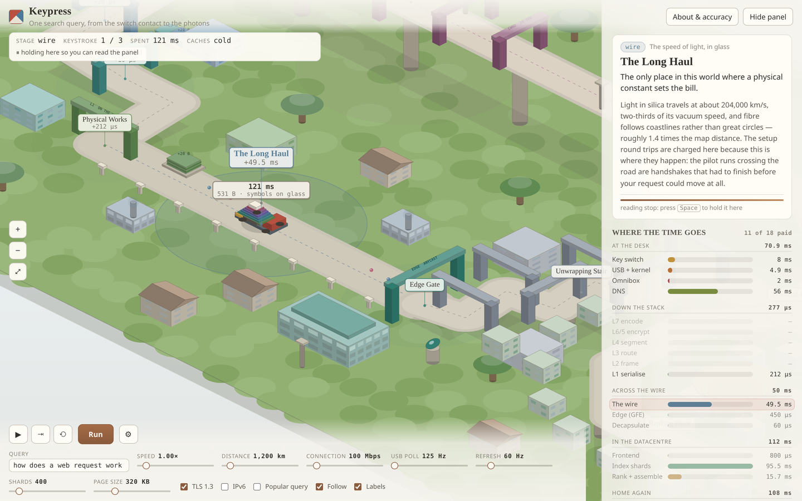

# Keypress

**One search query, from the switch contact to the photons.**



An isometric world you can walk through that runs a single web request end to
end — starting below the network stack, at two pieces of metal touching inside a
keyboard, and ending above it, at a liquid crystal turning. Everything in
between is computed live: the HPACK encoding of the request headers, every
standard-mandated header byte each OSI layer adds, the speed of light in a
silica fibre, TCP slow start, the tail-latency arithmetic of a thousand-way
index fan-out, and the wait for the next display refresh.

A trolley leaves a key switch carrying a closed circuit, climbs to the
application plateau as the signal becomes a byte and then a URL, descends six
terraces as each layer wraps it in another header, crosses a very long wire,
climbs the same six terraces in reverse on the far side, is answered by a
datacentre, and comes home on a viaduct to a monitor that will not accept it
until its next scan-out.

**The geography is the argument.** Going up means rising in abstraction; going
down means handing your message to something that understands less of it than
you do. The shells stacked on the trolley are the actual encapsulation state —
one tier per header currently applied, in that layer's colour — and its readout
is the actual byte count at that point in the stack.

## Running it

No build step, no dependencies, no network requests. Open `index.html`
directly, or serve the directory:

```sh
python3 -m http.server 8000
```

## The two ledgers

The panel shows two accounts of the same journey, and the whole point is that
they disagree about where the cost is.

| | Says |
|---|---|
| **Time waterfall** | The layers are free. Distance and clocks are everything. |
| **Byte ledger** | The layers are almost all of what you send. |

Both are true. At the defaults (1,200 km, 100 Mbps, 125 Hz polling, 60 Hz
display, 400 shards), a cold first keystroke costs **341 ms** end to end, of
which the entire six-layer descent is **277 µs** — under a thousandth. Meanwhile
the 27 bytes you actually typed leave the house inside a **531-byte** frame:
**5.1 % payload**. On the second keystroke, with the connection open and HPACK's
dynamic table warm, the request drops to **180 bytes** and 15.0 % payload, and
the total drops to **245 ms**.

## Controls

| | |
|---|---|
| **Space** / ❚❚ | Play / pause. Holds a reading stop indefinitely. |
| **S** / ⇥ | Advance exactly one station, then pause. |
| **R** / ⟲ | Reset and replay the slow tour. |
| **F** | Follow camera on/off. A drag also turns it off. |
| **L** | Labels on/off. |
| **Esc** | Close the About dialog. |
| Drag / scroll / double-click | Pan, zoom, fit the whole world. |
| ⤢ | Fit the whole world. |

The **Query** box is a real model input: its bytes are counted, percent-encoded
into the path, and the path is the one header HPACK cannot compress away on a
warm connection. Every slider changes a model parameter and takes effect
immediately; stations already charged keep the number they were charged, so
dragging mid-run only moves the bars still ahead of the trolley.

## Pacing

The first time the trolley reaches a station it stops for as long as that
station's write-up takes to read (9–26 s, from the word count at ~228 wpm), and
a bar under the panel text shows how much of the stop is left. Once every
district has been explained there is nothing new to read, so the remaining runs
go at a watchable pace instead of a readable one.

**The full first tour is about seven and a half minutes** — longer than these explainers
usually run, which is what eighteen stations spanning a switch contact to a
photon costs. The Speed slider scales all of it, reading stops included.

**Run** starts a new run and keeps what you have already read. **Reset (⟲)**
replays the slow tour. Three keystrokes run in a row on purpose: the second and
third are much cheaper and nothing about the network changed.

## Stations

24 stations across 7 routes, mapping to 18 narrated districts. The six unwrap
stops share one district so the same paragraph is not charged six times.

| Route | Station | District | Model step |
|---|---|---|---|
| `desk` | `keyswitch` | Key Switch Yard | matrix scan wait + debounce |
| | `hid` | HID Bench | USB poll wait + 8 B report + kernel dispatch |
| | `omnibox` | The Omnibox | URL synthesis |
| | `resolve` | Name Registry | DNS round trip (0 when warm) |
| `down` | `l7` | Application Terrace | HPACK encode + 9 B HTTP/2 frame |
| | `l6` | Cipher Terrace | +22 B TLS 1.3 record |
| | `l4` | Segment Terrace | +32 B TCP header and options |
| | `l3` | Packet Terrace | +20 B IPv4 / +40 B IPv6 |
| | `l2` | Frame Yard | +18 B Ethernet, padded to the 60 B minimum |
| | `l1` | Physical Works | +20 B preamble and gap; serialisation onto the uplink |
| `wire` | `haul` | The Long Haul | setup round trips + one-way propagation |
| | `edge` | Edge Gate | anycast landing, TLS termination |
| `up` | `u1`…`u6` | Unwrapping Stair | the same six headers, stripped |
| `dc` | `frontend` | Frontend Hall | results-cache lookup — **the one branch** |
| `loop` | `index` | Index Halls | shard fan-out with tail latency |
| | `rank` | Ranking Floor | scoring, merge, templating, brotli |
| `back` | `transfer` | Return Viaduct | slow start + transfer |
| | `paint` | Screen Works | decompress, parse, layout, paint, vsync, scan-out |

## Fidelity ledger

The same ledger is in the About dialog. Half the educational value of a thing
like this is the reader knowing which numbers to trust.

### Genuinely computed, live — `js/model.js`

**Bytes.** A real, abbreviated HPACK encoder (RFC 7541) over nine headers a
browser actually sends: exact static-table matches cost one indexed byte,
name-indexed literals cost an index plus an HPACK-varint length plus a
Huffman-coded value, and a dynamic table collapses everything but `:path` on a
reused connection. Then the mandated headers on top: 9 B HTTP/2 frame header
(RFC 9113); 5 + 1 + 16 B for a TLS 1.3 record and its AES-GCM tag (RFC 8446);
20 + 12 B for TCP with RFC 7323 timestamps; 20 or 40 B for IPv4 or IPv6; 14 + 4 B
Ethernet with padding to the 60 B minimum; 8 B preamble and 12 B interframe gap.
The maximum segment size falls out of the 1500 B MTU minus those headers
(1448 B on IPv4, 1428 B on IPv6).

**Time.** Mean wait for the next keyboard matrix sweep and the next USB poll,
both from the rates you set. The 8 B HID report at 12 Mbps full speed.
Propagation at the real speed of light in silica — 299,792.458 km/s divided by a
group index of 1.4675, so 204,287 km/s. Serialisation of the actual byte count
onto the actual uplink. Setup round trips at one for TCP and one or two for TLS
by version. Index fan-out tail probability as an exact 1 − (1 − p)^shards over
two tail tiers. Brotli compression. TCP slow start from a ten-segment initial
window (RFC 6928) doubling each round, taking whichever of bandwidth and round
trips binds. Mean wait plus scan-out for the display refresh rate. Every
displayed number is one of these.

### Scaled down

Twenty index halls stand in for however many shards the slider says (real search
runs thousands). Plate stacks show one plate per four bytes. The trolley wears
six shells; a real packet's headers are not visibly nested at all.

### Assumed

Real arithmetic on numbers nobody publishes. Each is marked `// ASSUMED` at its
point of definition in `js/model.js`: fibre path 1.4× map distance; 0.12 ms per
router hop; HPACK Huffman at 78 % of ASCII; 5 ms debounce; 0.9 ms kernel and
compositor dispatch; 6 ms median shard latency with a 1 % chance of a 55 ms tail
and a 0.04 % chance of a 240 ms stall; 8 M documents and 40 candidates per
shard; brotli at 4.2×; uplink one fifth of downlink; per-kilobyte parse, style,
paint and pixel-response costs. The cookie and user-agent strings are realistic
in shape and length but are nobody's real values.

### Deliberately simplified — and you would assume otherwise

- **A real page load is dozens of requests over several connections**, not one.
- **The response's own trip is not walked.** The trolley is re-wrapped at the
  Ranking Floor and unwrapped at the Screen Works, so the byte ledger you see is
  the *request's*, not the response's.
- **DNS is charged as one round trip** rather than driven as its own journey,
  though it is exactly the same journey.
- **The results cache sits at the frontend.** The real thing is more layered.
- **The datacentre is one building.** In reality the query crosses several more
  networks inside it than it did to get there.
- **Handshake round trips are charged at the wire**, not at the terraces that
  own the protocols, because that is where they physically happen. The pilot
  dots shuttling down the wire road are those round trips.

### Scenery vs. instrument

Grass, trees, background blocks and km posts are scenery. The **landmarks are
not**: the plate stacks are the bytes each layer adds, the hopper mouth is the
candidate count, the lit shard halls and their laggards come from the tail
probabilities, the congestion-window gantries are the actual slow-start rounds,
the poll clock turns at the poll rate, the monitor's scan line runs at the
refresh rate, and the trolley's shells are the encapsulation state. Change a
slider and they change.

## Files

```
index.html          markup, controls, the About modal with the fidelity ledger
css/styles.css      light print-like UI: full-screen canvas, floating panels
js/iso.js           ENGINE. Projection, solids, routes. Unchanged from the skill.
js/model.js         THE LESSON. The real simulation. Runs standalone in node.
js/world.js         the static place: routes, stations, districts, buildings
js/sim.js           ENGINE. State machine: travel, stations, reading stops.
js/render.js        one sorted painter's pass over everything with a footprint
js/ui.js            DOM panels, live numbers, narration, controls
js/main.js          ENGINE. Camera, input, frame loop.
smoke.mjs           headless check: console errors, every station, a screenshot
```

`js/model.js` is a CommonJS module as well as a browser global, so it can be
poked at directly:

```sh
node -e "const S=require('./js/model.js');
  console.log(S.encapsulate({query:'hello', ipv6:false, reuse:false}))"
```

## If you are modifying this

Three things that will bite you, in rough order of how much time they cost:

1. **The occlusion rule.** A solid at `(mx, my)` hides the road point at
   `(mx, by)` once half its footprint, `(w + d) / 2`, exceeds its setback
   `my - by`. Big halls stand well back or they swallow the trolley at exactly
   the station they represent. There is an audit for this in the verification
   snippet below.
2. **One sorted list.** Everything with a ground footprint sorts together on
   `x + y`. Anything the road passes *under* — the layer gantries, the edge
   arch, the congestion-window gantries — is registered as three separate pieces
   (`gatePost`, `gateBeam`, `gatePost`) so the near post sorts in front of the
   trolley rather than behind it.
3. **`routes` and `stations`.** A route is a polyline parameterised by distance;
   a station is a distance along it that fires a model step. Stations are
   anchored to *waypoint indices* (`station(DOWN, 3, 'l6')`), never to measured
   distances, so moving the layout does not silently move the stations. Every
   route change in the whole simulation lives in one function,
   `advanceRoute()` in `js/sim.js`, and there is exactly one branch: the results
   cache at the Frontend Hall.

## Verifying

```sh
# syntax — a loop, because `node --check` only checks its first argument
for f in js/*.js; do node --check "$f" || echo "FAIL $f"; done

# console errors, every station, and a screenshot
npm i -D playwright && npx playwright install chromium
python3 -m http.server 8000 &
node smoke.mjs http://localhost:8000/ --steps 90 --dpr 2
```

**Then look at the screenshot.** Occlusion, label collisions and plates landing
on empty ground raise no errors.

Layout audit — buildings that would swallow the trolley:

```sh
node -e "
global.window=global;
global.Iso={makeRoute:(raw)=>{const pts=raw.map(p=>({x:p[0],y:p[1],z:p[2]||0}));
  let t=0;const cum=[0],segs=[];for(let i=0;i<pts.length-1;i++){const a=pts[i],b=pts[i+1];
  const len=Math.hypot(b.x-a.x,b.y-a.y)||0.001;segs.push({a,b,len,cum:t});t+=len;cum.push(t);}
  return{pts,segs,total:t,cum};},hash2:()=>0.5};
require('./js/world.js'); const W=global.World; W.build(); let bad=0;
W.buildings.forEach(b=>{if(!b.w)return;const half=(b.w+b.d)/2;
  const d=W.distToRoutes(b.x+b.w/2,b.y+b.d/2);
  if(d<half){bad++;console.log('OCCLUDES',b.x,b.y,'half',half.toFixed(1),'dist',d.toFixed(1));}});
console.log('warnings',bad);"
```

---

Built from the `isometric-explainer` skill. All code and copy original.
`js/iso.js`, `js/sim.js` and `js/main.js` are the skill's engine, near-unchanged;
`js/model.js` and `js/world.js` are entirely this project.
